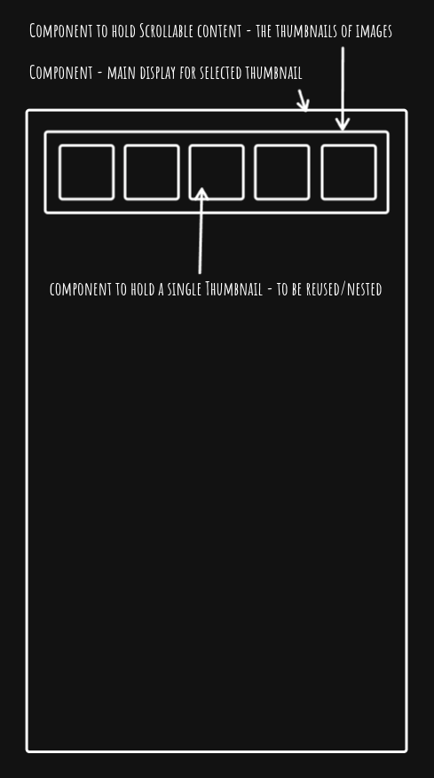
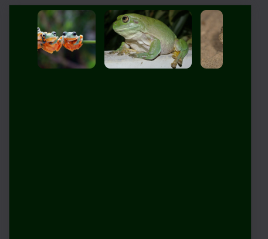

## Requirements

    🎯 Implement the useState hook to manage gallery state (e.g. selected image).

    🎯 Use useEffect for initial fetching of images from an external API.

    🎯 Return JSX from multiple components (e.g., an ImageItem component for each image and a Gallery component to display them).

    🎯 Use the .map() function to render an array of images dynamically

    🎯 Implement functionality to display a larger version of an image when its thumbnail is clicked.

    🎯 Ensure all images have meaningful alt text.

    🎯 Ensure basic keyboard navigation for image selection (e.g., thumbnails should be focusable and activatable with Enter/Space).

## Stretch Requirements

    🏹 Use useEffect and the dependency array to update the images when the user types in an input field.

    🏹 Set up an Unsplash application that you can fetch from your React app.

    🏹 Use .env to hide your API keys and tokens from the code.

    🏹 Style the application excellently, using grid or flex and positioning.

### checkpoint 1

    Basic template and repo created

### checkpoint 2

    Site published to render.com

    Wireframe for mobile, The simplicity of this app means that the desktop just extends the viewing area, but to demonstrate responsiveness, I plan to relocate the thumbnail holder to a different location for different screen sizes.

### checkpoint 3

    I have the images loading from the API, I have them in a dedicated component that is now rendering in the correct location and is scrolling on a mobile device as I want, although they still look ugly as hell on desktop, seems the way to fix this would be to use/build a gesture component, but thats way out of scope so for now its stays ugly on desktop.

    Next up will be adding a callback to the ThumbnailBar component to handle selection changes.

###### (If you can read this line then the assignment is incomplete, it will have been submitted early to avoid a zero score, maybe a tornado swept me and my computer away and I am fighting the oompa loompas to get back, wait thats not the wizard of oz ... I plan to remove this comment once I am happy I have completed everything.)

###### Sources:

https://publicdomainvectors.org/en/free-clipart/Cartoon-frog/49778.html Cartoon-Frog.svg
